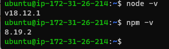
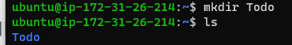
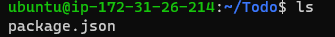
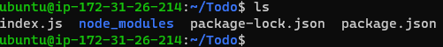
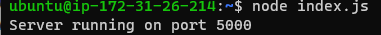
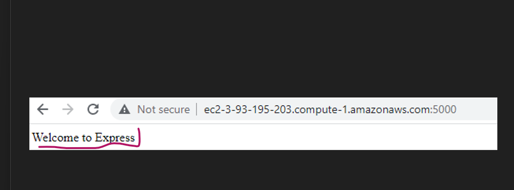
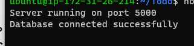
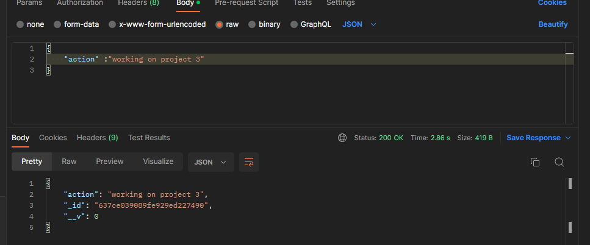
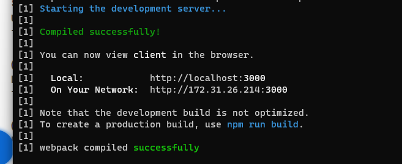
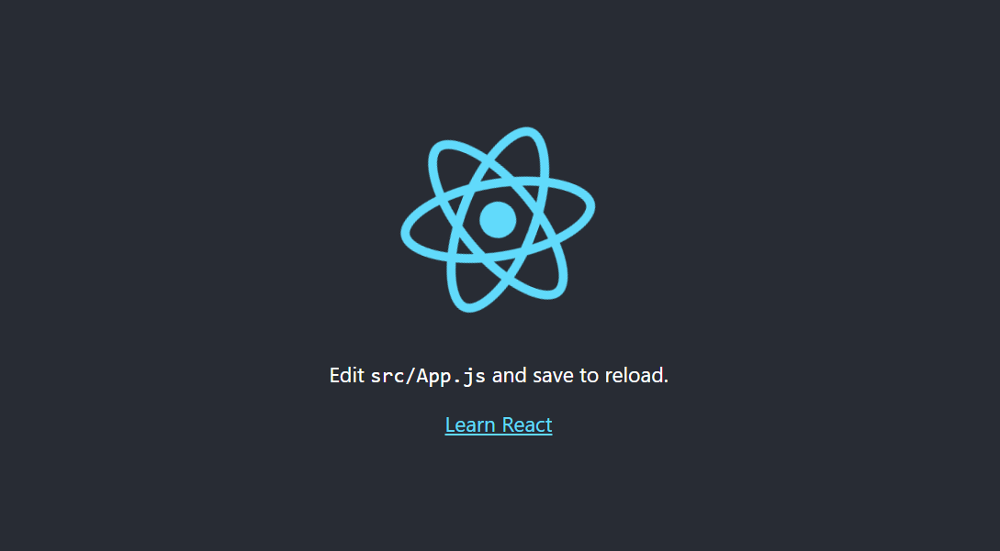

# Project3
 Step1:BACKEND CONFIGURATION
* ### Commands:
* sudo apt update 
* sudo apt upgrade 
* `curl -fsSL https://deb.nodesource.com/setup_18.x | sudo -E bash -`
* sudo apt-get install -y   nodejs
*  node -v
*  npm -v

* 

*  mkdir Todo
*  ls
*  cd Todo
* 
*  npm init
*  ls   

* 

#  INSTALL EXPRESSJS
*  ## commands:
*  npm install express
*  touch index.js
*  ls 

*  

* npm install dotenv 
* vim index.js 
* node index.js
*  
*  http://3-93-195-203:5000

*  

*  mkdir routes
*  cd routes
*  touch api.js
*  vim api.js
*  #  MODELS
* ## Commands:
*  npm install mongoose
*  mkdir models
*  cd models
*  touch todo.js
* mkdir models && cd models && touch todo.js 
*  `vim todo.js` :To open file todo.js
*  `vim api.js` :To open api.js
*  ` :%d`  :To delete the code
# MONGODB DATABASE
* touch .env 
* vi .env
* DB = 'mongodb+srv://<username>:<password>@<network-address>/<dbname>?retryWrites=true&w=majority' : To access database 

* vim index.js :To open file index.js 
* press `esc`
* type  ` :`
* type ` %d`
*  hit enter"
*  node index.js

# FRONTEND CREATION
## Commands:
 * npx create-react-app client
 * npm install concurrently --save-dev
 * npm install nodemon --save-dev
 * cd client
 * vi package.json
 * npm run dev 
 * 
  *  
 * cd client
 * cd src
 * mkdir components
 * cd components
 * touch Input.js ListTodo.js Todo.js
 * vi Input.js 
 * cd .. 
 * cd ..
 * npm install axios
 * vim index.css
 * cd ../..
 * npm run dev
 
 
 
